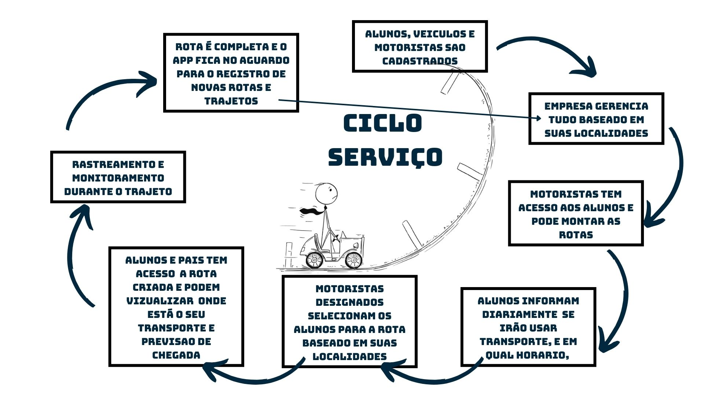

---
## Descrição do Projeto:

> Após dialogarmos com administradores de diversas empresas de transporte escolar, identificamos que o gerenciamento manual das rotas frequentemente se revela um processo moroso e ineficiente, especialmente quando há um grande número de alunos a serem atendidos. Diante desse cenário, nosso sistema foi concebido com o propósito de otimizar essa gestão, oferecendo um serviço automatizado de planejamento de rotas. A solução permite que a empresa insira os endereços dos alunos, bem como os pontos de partida e destino, para então calcular a rota mais eficiente. Além disso, o sistema realiza a distribuição estratégica dos alunos entre diferentes veículos, agrupando aqueles cujos trajetos apresentam maior similaridade.

---

## Membros:

<table>
<tr>
<td align="center">
   <b>Anthony Loche Dos Reis</b>  
   
    
<!--     -->
<!--     -->
</td>
<td align="center">
   <b>Jonatas Silva Peraza</b>  
   
    
<!--     -->
<!--     -->
</td>
<td align="center">
   <b>Pedro Henrique Malaquias</b>  
   
    
<!--     -->
<!--     -->
</td>
</tr>
</table>

---

## 🛠 Tecnologias Utilizadas

- **Linguagens**:  
- **Frontend**: 
- **Backend**: 
- **Ferramentas**:  

---

## 🛠 Links:

- 🚀 **BackEnd**: [GoRoutes_BackEnd](https://github.com/GoRoutes/GoRoutes_BackEnd)  
- 🎨 **FrontEnd**: [GoRoutes_FrontEnd](https://github.com/GoRoutes/GoRoutes_FrontEnd)  
- 📄 **Docs**: [Docs_GoRoutes](https://github.com/GoRoutes/Docs_GoRoutes)  
- 🎨 ✏️ **Figma**: [GoRoutes Design](https://www.figma.com/design/Pm53DckyC128A7oBmkp6RP/GoRoutes?node-id=0-1&p=f&t=4rlqR8FZlcixSg3n-0)  

---

## 🛠 Padrões:

  
Padrão de branch

    
  - **ESCOPO:** Deve refletir a funcionalidade ou tela que está sendo trabalhada.
  - **NUMERODATAREFA:** O número da tarefa ou issue correspondente.
  - **TIPO:** Tipo de tarefa (Feat, Fix, Chore).
    
  ### Exemplos de branches:
    Tarefa: Tela de Login(#1)
    Nome da Branch: FEAT(Login)-1

    Tarefa: Tela de Cadastro (#3)
    Nome da Branch: FEAT(Register)-3
    

  
Padrão de Commit

    
  - **ESCOPO:** Deve refletir a funcionalidade ou tela que está sendo trabalhada.
  - **NUMERODATAREFA:** O número da tarefa ou issue correspondente.
  - **TIPO:** Tipo de tarefa (Feat, Fix, Chore).
    
  ### Exemplos de branches:
    Tarefa: Tela de Login(#1)
    Nome da Branch: FEAT(Login): Fiz a tela de logn [Refs: #3]

    Tarefa: Tela de Cadastro (#3)
    Nome da Branch: FEAT(Register): Fiz a tela de registro [Refs: #3]
    

  
Padrão de Roteiro de Pull Request

    
 ### Test Plan for **Nome Da Task**

#### Actions Taken:
- <<Ação Realizada 1>>
- <<Ação Realizada 2>>

#### Required Tests:
1. <<Fazer ação x>>
2. <<Fazer ação y>>

#### Tested Browsers:
- [ ] Chrome
- [x] Edge
- [ ] Firefox
- [ ] Safari
- [ ] Opera

#### Notes:
- <<Notas/Observações>>

#### Closing Keywords:
- Resolves #<<Número da Issue>>

---

## Fluxo de Serviço:

---

## Proposta Descrição
Gerenciar rotas de vans

O foco do GoRoutes é permitir um melhor gerenciamente de rotas para os mototristas, alunos, e admins

No sistema haverá 3 niveis de ususario um para o admin que gerenciara tods as rotas sem restrições o motorista que pode fazer pequenas alterações em sua rota, e o aluno que poderá apenas visualizar e dizer se voltara em horarios diferentes

O sistema poderá calcular rotas automaticamentes com base nas informçõe que os alunos forneceram sobre seu retorno ou sobre seus pontos de parada personalizado.o sistema tambem devera mostrar ao aluno sua posição de parada, exemplo(Voce é 4° a ser deixado), juntamente com sistema de localização para os responsaveis visualizar a posição do motorista

